# System Diagrams - Data Migration Tool

This document contains all the architectural and design diagrams for the Data Migration Tool project.

---

## 1. Sequence Diagram - Migration Flow

### App.java (Automatic Migration)

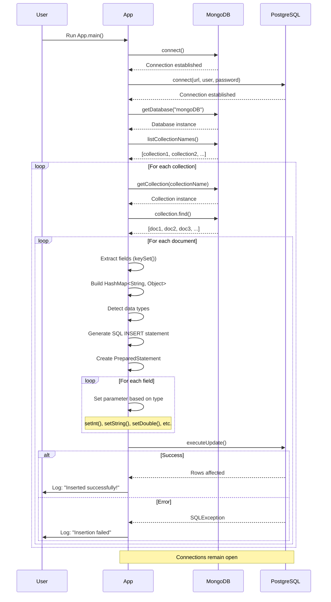

### App2.java (Configuration-Based Migration)

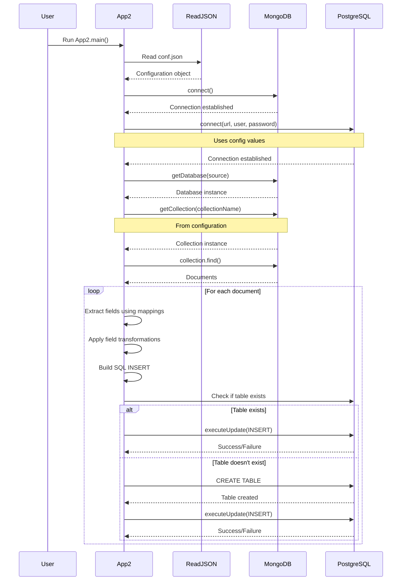

---

## 2. Class Diagram

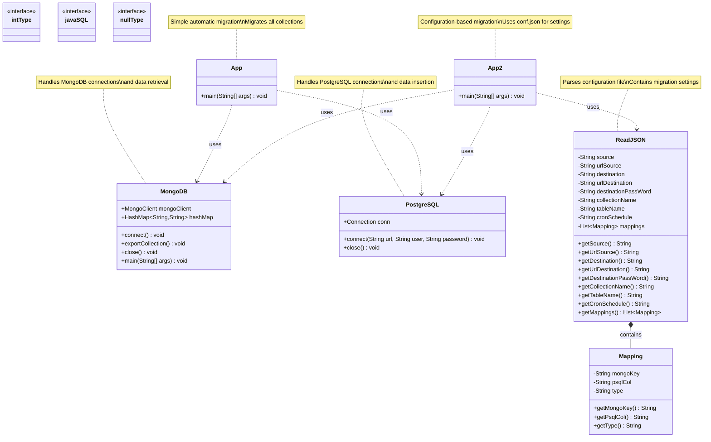

---

## 3. Component Diagram

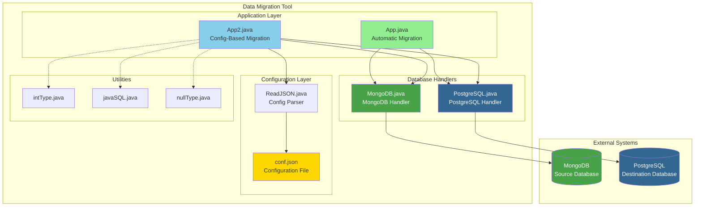

---

## 4. Architecture Diagram - Data Flow

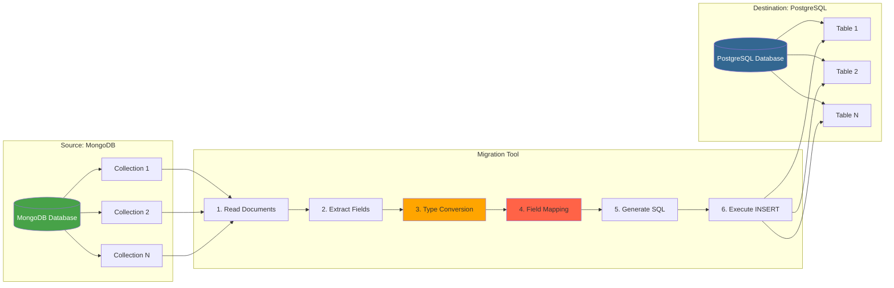

---

## 5. ERD (Entity Relationship Diagram)

### MongoDB Schema (Document Model)

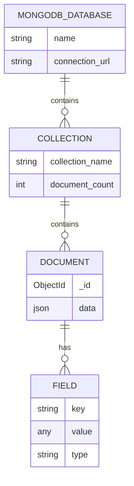

### PostgreSQL Schema (Relational Model)

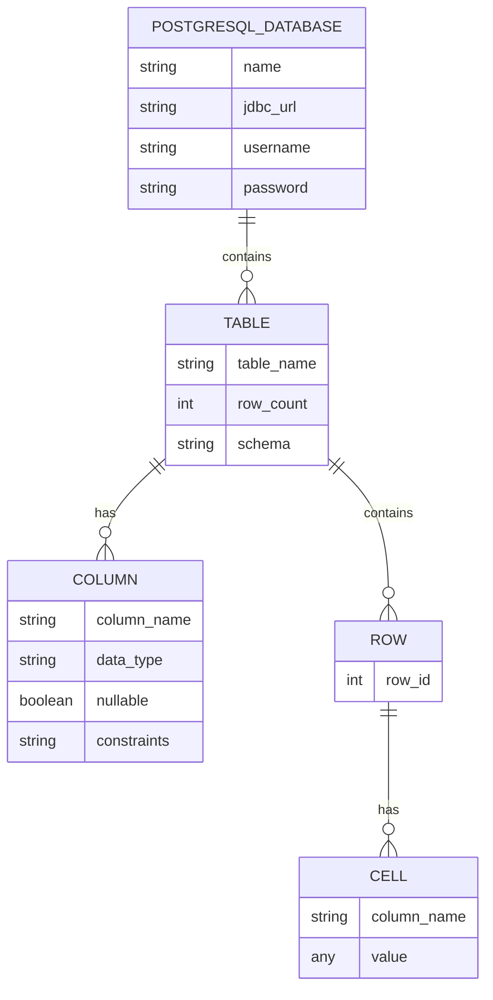

### Migration Mapping

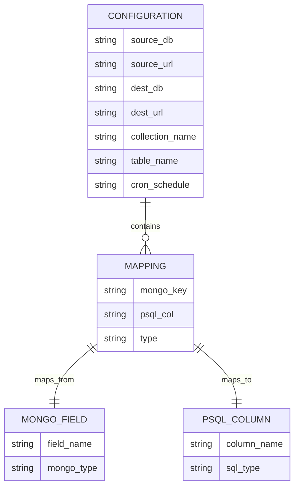

---

## 6. State Diagram - Migration Process

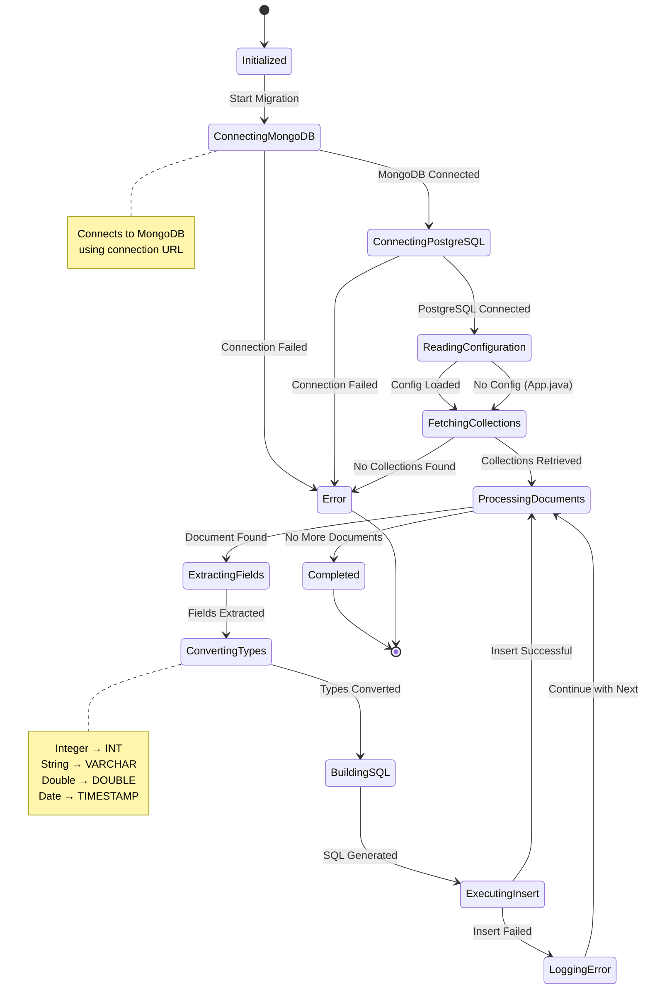

---

## 7. Deployment Diagram

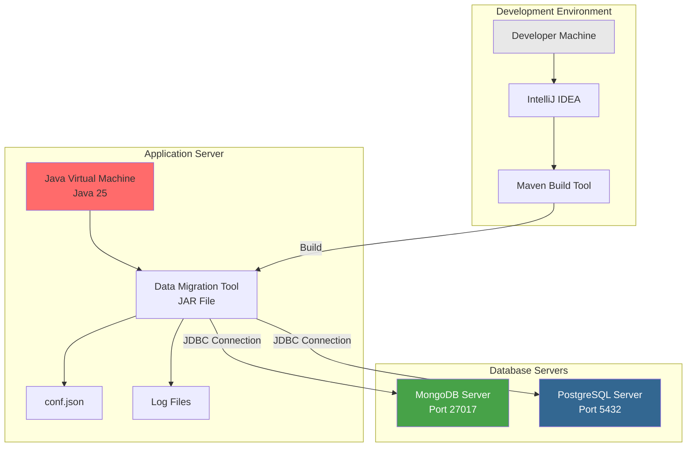

---

## 8. Activity Diagram - Complete Migration Workflow

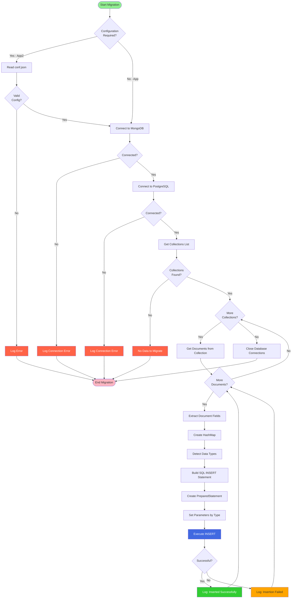

---

## 9. Type Conversion Matrix

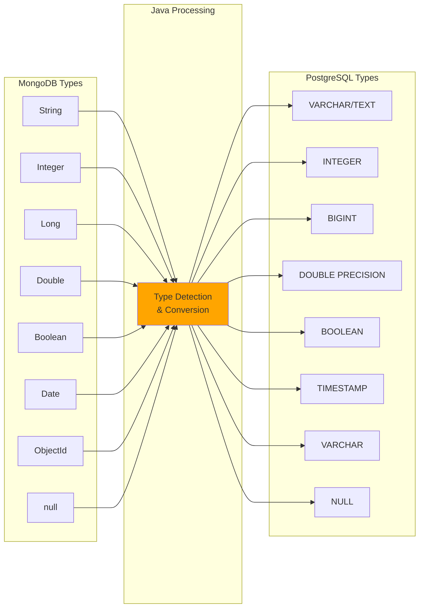

---

## Diagram Usage Guide

### For Developers
- **Sequence Diagrams**: Understand the flow of method calls
- **Class Diagram**: See the structure and relationships
- **Activity Diagram**: Follow the complete workflow logic

### For Architects
- **Component Diagram**: Understand system modules
- **Architecture Diagram**: See data flow between systems
- **Deployment Diagram**: Plan infrastructure

### For Database Administrators
- **ERD Diagrams**: Understand data models
- **Type Conversion Matrix**: See how data types map

### For Project Managers
- **State Diagram**: Track migration states
- **Activity Diagram**: Understand the process flow
